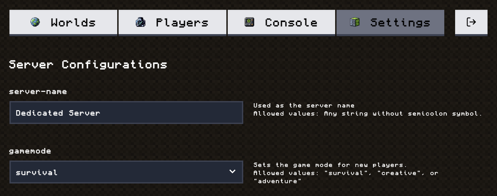

# Craft Console

A web-based management console for Minecraft Bedrock servers. Upload and run server binaries, view real-time logs, and edit `server.properties` — all from a browser.



---

## Getting Started

### Prerequisites

- [Node.js](https://nodejs.org/) 24+
- [Yarn](https://yarnpkg.com/) 4+

### Install dependencies

```bash
yarn install
```

### Configure environment

Copy the example env file and set your admin credentials:

```bash
cp .env.example .env
```

```env
ADMIN_USER=your_username
ADMIN_PASS=your_password
```

### Run in development

```bash
yarn dev
```

The app will be available at `http://localhost:5173`.

---

## Deployment

A Docker image is automatically published to GitHub Container Registry on every push to `main`.

### Pull and run

```bash
docker run -d \
  -p 3000:3000 \
  -p 19132:19132/udp \
  -p 19133:19133/udp \
  -e ADMIN_USER=admin \
  -e ADMIN_PASS=secret \
  -v /path/to/data:/app/data \
  ghcr.io/thani-sh/craft-console:latest
```

> **Tip:** Mount a volume at `/app/data` to persist server files across container restarts.

### Build locally

```bash
docker build -t craft-console .
```

## License

[MIT](LICENSE)
